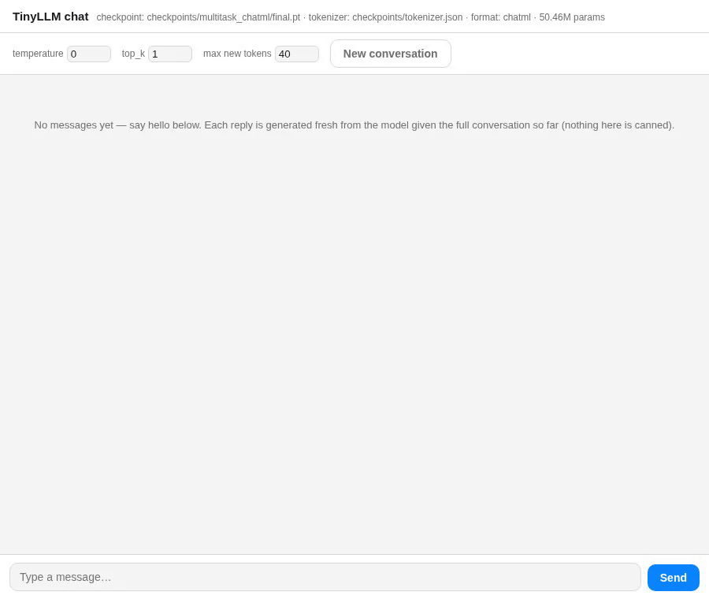

# 🧠 TinyLLM — Build an LLM From Scratch

> A minimal, heavily-commented GPT-style language model for learning purposes.
> Every component is implemented from scratch — no HuggingFace, no pre-built transformers.

## 💡 Why TinyLLM?

Most from-scratch LLM repos optimize for one thing: getting the training loss down.
[Karpathy's nanoGPT](https://github.com/karpathy/nanoGPT) is the gold standard for that —
but reproducing a GPT-2-quality run out of it means renting cloud A100s, which realistically
costs on the order of **$100+** and hours of babysitting a training job you can't iterate on
casually.

TinyLLM optimizes for the other thing: **understanding**. Every stage a real LLM pipeline
goes through — tokenizer training, pretraining on raw text, instruction fine-tuning,
reasoning fine-tuning with tool-use, and a chat interface to actually talk to the result —
is here, small enough to run end-to-end **on a single consumer GPU you already own**, in
minutes to hours instead of days. You're not spectating a loss curve on someone else's
infrastructure; you're stepping through the same pipeline GPT/LLaMA use, just at a scale
where you can read every line, change it, and watch what breaks.

### 🖥️ Minimum Requirements

| Resource | Minimum | Notes |
|----------|---------|-------|
| **GPU** | None required | Falls back to CPU automatically (`train.py`/`pretrain.py`) — slower, but every script runs |
| **GPU (recommended)** | RTX 3060 (12 GB) or similar Ampere+ card | Ampere+ is needed to actually benefit from `bfloat16` mixed precision (see [Mixed Precision](#-mixed-precision-bfloat16)); the default "Tiny" config trains comfortably within a few GB of VRAM |
| **RAM** | 16 GB | Covers dataset downloads (Alpaca/Dolly/GSM8K/WikiText-2 are all small, low hundreds of MB combined) and tokenizer training |
| **Disk** | ~2 GB free | Raw datasets + checkpoints + optional W&B logs |
| **Python** | 3.10+ | With PyTorch (CUDA build optional, see [Quick Start](#-quick-start)) |

No multi-GPU setup is required — DDP support exists for when you *have* more than one GPU,
not as a prerequisite for anything in this repo to work.

## 📑 Table of Contents

- [Chat UI](#️-chat-ui)
- [What You'll Learn](#-what-youll-learn)
- [Datasets & Data Pipeline](#-datasets--data-pipeline)
- [Quick Start](#-quick-start)
- [Limitations & Caveats](#-limitations--caveats)
- [Experiment Ideas](#-experiment-ideas)
- [Key Papers](#-key-papers)

---

## 🖥️ Chat UI



This is a real, unedited session in `webchat.py` against a 50M-param checkpoint
(`train_reasoning.py --dataset_format chatml`) trained jointly on multi-turn small talk and
1-/2-/3-hop synthetic word problems, pooled as equals rather than one being "replay" for the
other — see `data_utils.prepare_multitask_data`. Turns are rendered ChatML-style
(`<|im_start|>{role}...<|im_end|>`, same scheme Qwen/GPT use), and the loss is masked to
assistant spans only.

"Good morning" and "Can you tell me a joke?" are answered exactly as trained — this is the
point of the demo, not a limitation: the goal of this stage isn't teaching the model to
generalize, it's taking it from outputting nonsense to reliably answering things close to
what it was trained on. The word problem is different: it's pulled from
`data/reasoning_heldout.json`, held out and never trained on. The reasoning trace is real —
each `<CALC>` call is the model deciding *when* and *what* to compute, with the actual
arithmetic result injected rather than guessed (`model/calculator.py`, `model/generate.py`)
— and renders as a collapsible "Thoughts" section, Claude/ChatGPT-style, instead of inline
with the answer.

Once you have a checkpoint, there are two ways to talk to it:

- **`chat_demo.py`** — CLI demo that feeds a fixed sequence of questions to prove the
  pipeline works end-to-end.
- **`webchat.py`** — a real chat UI in your browser, for typing arbitrary follow-ups
  yourself and watching the answer stream in token by token, the same way a real LLM
  actually generates:

```bash
python -m demo.webchat \
    --checkpoint checkpoints/multitask_chatml/final.pt \
    --tokenizer_path checkpoints/tokenizer.json \
    --format chatml
# opens http://127.0.0.1:8765
```

It's a tiny stdlib-only HTTP server (no extra `pip install` beyond training) serving a
static chat page. `/chat` streams newline-delimited JSON as generation proceeds —
`model/generate.py`'s `on_token` hook fires once per token actually appended to the
sequence, so the browser renders each token as it's produced instead of blocking until
the whole reply is ready. It's **stateless by design**: the browser resends the full
conversation history with every request and the server rebuilds the prompt from scratch
each time — the same mechanic real chat APIs use, and it means what you see is exactly
what the model does with the conversation so far, not some server-side memory trick.

This model is small enough to generate a full reply in well under a second on either
CPU or GPU — much faster than real LLM APIs, whose pace is normally set by network +
far larger model compute. The GIF above was recorded with `--stream_delay_ms 70`, an
artificial per-token pause meant for demos/recordings; it defaults to `0` (as fast as
the model actually generates) for real use.

---

## 📚 What You'll Learn

### 🔤 1. BPE Tokenization (`tokenizer.py`)

**Byte Pair Encoding** is how GPT-2/GPT-4 turn raw text into numbers.

**The algorithm:**
1. Start with characters as vocabulary
2. Count all adjacent token pairs in the corpus
3. Merge the most frequent pair into a new token
4. Repeat until vocab size is reached

> 💡 **Key insight:** `"lower"` → `["▁low", "er"]`, `"lowest"` → `["▁low", "est"]`.
> Common subwords get merged; rare words stay as characters. Handles OOV words gracefully.

**Special tokens:**

| Token | ID | Purpose |
|-------|----|---------|
| `<PAD>` | 0 | Padding |
| `<UNK>` | 1 | Unknown token |
| `<BOS>` | 2 | Beginning of sequence |
| `<EOS>` | 3 | End of sequence ← **model stops here** |

---

### 🏗️ 2. Transformer Architecture (`model.py`)

#### 🔍 Multi-Head Self-Attention
```
Attention(Q, K, V) = softmax(QK^T / sqrt(d_k)) * V
```
| Symbol | Role |
|--------|------|
| **Q** (Query) | "What am I looking for?" |
| **K** (Key)   | "What information do I have?" |
| **V** (Value) | "What do I actually return?" |

- Division by `sqrt(d_k)` prevents softmax from saturating in high dimensions
- **Causal mask**: future tokens get `-inf` → 0 probability (autoregressive)
- **Multiple heads**: each head learns different relationship types (syntax, semantics, coreference…)

#### ⚡ Feed-Forward Network
```
FFN(x) = GELU(xW₁ + b₁)W₂ + b₂
```
Applied position-wise. Acts like "memory" — stores factual associations.

#### 🔧 Other Key Components

| Component | What it does |
|-----------|-------------|
| **Pre-norm** (`x + sublayer(LayerNorm(x))`) | More stable gradients than post-norm (GPT-2 style) |
| **Residual connections** (`x = x + sublayer(x)`) | Prevent vanishing gradients in deep networks |
| **Weight tying** | Embedding matrix and LM head share weights → fewer params |

---

### 🚀 3. Training (`train.py`)

**Objective:** Causal Language Modeling — given `[t1, t2, t3, t4]`, predict `[t2, t3, t4, t5]`.

#### 📈 Learning Rate Schedule
```
Warmup  →  lr = max_lr × (iter / warmup_iters)
Cosine  →  lr = min_lr + (max_lr - min_lr) × 0.5 × (1 + cos(π × progress))
```

#### 🛡️ Gradient Clipping
```python
torch.nn.utils.clip_grad_norm_(model.parameters(), max_norm=1.0)
```
Prevents sudden loss spikes by scaling down large gradients.

#### 🗜️ Gradient Accumulation
Simulates larger batches without extra memory:
```python
for micro_step in range(grad_accumulation_steps):
    loss = model(batch) / grad_accumulation_steps
    loss.backward()
optimizer.step()  # Only step once per "logical" batch
```

#### ⚡ Mixed Precision (bfloat16)

| Format | Bits | Range | Precision | Benefit |
|--------|------|-------|-----------|---------|
| float32 | 32 | ±3.4×10³⁸ | ~7 digits | Training stable |
| bfloat16 | 16 | ±3.4×10³⁸ | ~3 digits | **2-4× faster, ~50% less VRAM** |

> bfloat16 > float16 for training — same dynamic range, no loss scaling needed.

---

### 🖥️ 4. Multi-GPU Training with DDP (`train.py`)

```
GPU 0: model copy → forward(batch_shard_0) → backward → gradients ─┐
GPU 1: model copy → forward(batch_shard_1) → backward → gradients ─┤
                                                                     ↓
                                             All-Reduce (NCCL): avg gradients
                                                                     ↓
                                         Both GPUs update weights identically
```

**torchrun** sets these environment variables automatically:

| Variable | Meaning |
|----------|---------|
| `RANK` | Global process index (0 = master) |
| `LOCAL_RANK` | GPU index on this node |
| `WORLD_SIZE` | Total number of processes |

---

### 💬 5. Text Generation (`generate.py`)

**Autoregressive loop:** feed tokens → sample next token → append → repeat → **stop at `<EOS>`**

#### 🎲 Sampling Strategies

| Strategy | How | Effect |
|----------|-----|--------|
| **Greedy** (temp=0) | Always pick argmax | Deterministic, can be repetitive |
| **Temperature** `T < 1` | Sharpen distribution | More confident, less creative |
| **Temperature** `T > 1` | Flatten distribution | More random, more creative |
| **Top-k** | Sample from top-k tokens only | Blocks very unlikely tokens |
| **Top-p (nucleus)** | Sample from smallest set with cumulative prob ≥ p | Adaptive to model certainty |

---

## 📦 Datasets & Data Pipeline

At this scale, throwing generic text at the model isn't enough — both *what* the shared
tokenizer sees and *what skill* each stage is asked to learn have to be deliberately
scoped down to something learnable at 10M–65M parameters. TinyLLM mixes real corpora
with purpose-built synthetic data for exactly that reason.

### Stage 0 — one-time setup (`prepare_pipeline_data.py`)

```bash
python -m data_pipeline.prepare_pipeline_data --force_retrain_tokenizer   # first run, or to fold in a new corpus
```

Downloads real datasets, builds one shared BPE tokenizer used by every later stage, and
writes the per-stage files everything else reads from:

| Source | Used for | Output |
|--------|----------|--------|
| WikiText-2 (real Wikipedia prose) | Stage 1 pretraining — Alpaca/GSM8K text alone has essentially no world-knowledge exposure | `data/raw_text/corpus.txt` |
| Alpaca + Dolly-15k | Stage 2 instruction SFT | `data/sft_dataset.json` |
| GSM8K (train/test) | Stage 3 reasoning SFT (real chain-of-thought math) | `data/reasoning_dataset.json` |

Re-running is safe and cheap — downloads are skipped if already present, and the tokenizer
is reused (not retrained) by default so changing the SFT mix later doesn't invalidate an
existing pretrained checkpoint's vocabulary.

### Synthetic data generators

Real datasets like GSM8K are open-domain and hard for a 10M-param model to make progress
on quickly. TinyLLM also ships generators for narrower, controlled tasks it *can* actually
learn:

- **`generate_synthetic_reasoning.py`** → `data/synthetic_reasoning_all_hops.json` — templated
  1-, 2-, and 3-hop arithmetic word problems. The `<CALC>` tool already guarantees correct
  arithmetic (see [Limitations](#-limitations--caveats)), so this isolates the actual hard
  part: correctly reading which numbers and operation a problem calls for.
- **`generate_smalltalk_multiturn.py`** + **`build_smalltalk_demo_dataset.py`** →
  `data/smalltalk_multiturn.json` / `data/smalltalk_demo.json` — multi-turn small-talk
  conversations built by cross-combining independent "opener" and "follow-up" pools, so
  every opener is followed by many different follow-ups. This forces the model to actually
  read turn 2 instead of memorizing one fixed script per opener.

Both feed `train_reasoning.py --dataset_format chatml`, which pools chat and reasoning
conversations as equals through `data_utils.prepare_multitask_data` — see the
[Chat UI](#️-chat-ui) section above for what that checkpoint can do.

### Bring your own data

You can also train TinyLLM on your own question-answer data using a simple JSON format.

#### Format

```json
[
  {
    "id": 1,
    "category": "Identity",
    "question": "Who are you?",
    "answer": "I am TinyLLM, a small but capable language model here to help you!"
  },
  {
    "id": 2,
    "category": "Identity",
    "question": "What is your name?",
    "answer": "My name is TinyLLM."
  }
]
```

| Field | Required | Description |
|-------|----------|-------------|
| `id` | No | Unique identifier (ignored during training) |
| `category` | No | Grouping label (ignored during training) |
| `question` | ✅ Yes | The input question text |
| `answer` | ✅ Yes | The expected answer text |

#### How It Works

Each Q&A pair is automatically wrapped with boundary tokens before training:

```
<BOS> Question: Who are you?
Answer: I am TinyLLM, a small but capable language model here to help you! <EOS>
```

This teaches the model **where answers end** — without `<EOS>` boundaries, the model would answer a question and then immediately ask itself another one and keep going indefinitely.

#### Training on Custom Data

```python
from data_utils import prepare_custom_data, create_dataloader

train_ds, val_ds, tokenizer = prepare_custom_data(
    json_path="data/my_dataset.json",
    vocab_size=2000,
    context_length=128,
    force_retrain_tokenizer=True,  # retrain so BOS/EOS appear in the corpus
)

loader = create_dataloader(train_ds, batch_size=8)
```

#### Stopping at `<EOS>` During Inference

Your generation loop must honour the `<EOS>` token:

```python
for _ in range(max_new_tokens):
    logits = model(input_ids)
    next_token = logits[:, -1, :].argmax(dim=-1)
    if next_token.item() == tokenizer.eos_id:
        break                                        # ← stop here!
    input_ids = torch.cat([input_ids, next_token.unsqueeze(0)], dim=1)
```

---

## ⚡ Quick Start

### Install
```bash
pip install torch --index-url https://download.pytorch.org/whl/cu121
```

### Train (single GPU)
```bash
python -m training.train
```

### Train (multi-GPU)
```bash
torchrun --nproc_per_node=2 -m training.train
```

### Train with custom settings
```bash
torchrun --nproc_per_node=2 -m training.train \
    --batch_size 32 \
    --max_iters 5000 \
    --d_model 512 \
    --n_layers 8
```

### Monitor training with Weights & Biases
Both `train.py` (SFT) and `pretrain.py` support optional [W&B](https://wandb.ai) logging of train/val
loss, perplexity, learning rate, tokens/sec, and gradients — off by default, opt in with `--use_wandb`.
```bash
pip install wandb
wandb login
python -m training.train --use_wandb --wandb_project tinyllm-sft --wandb_run_name my-run
python -m training.pretrain --use_wandb --wandb_project tinyllm-pretrain
```

### Generate text
```bash
python -m demo.inference \
    --checkpoint checkpoints/latest.pt \
    --prompt "Who are you?" \
    --temperature 0.8 \
    --top_k 50 \
    --max_tokens 300
```

---

## ⚠️ Limitations & Caveats

TinyLLM is a *learning tool*, not a production model — knowing where it falls short is
part of understanding how it works:

- **No world knowledge.** The default config is ~10M parameters (bump `d_model`/`n_layers`
  via CLI flags and it scales to tens of millions — see `model/config.py`), trained on a
  small corpus. That's nowhere near enough capacity or data to have memorized facts the
  way GPT-3/4 does. It will confidently make things up (hallucinate) outside what it was
  trained on.
- **Short context window.** `context_length` is 256 tokens by default — a few paragraphs.
  Long documents or long conversations will simply fall off the front of the window.
  Compare to production LLMs, which use 32K–1M+ token windows.
- **Small vocabulary.** `vocab_size=10000` (vs. ~100K+ for GPT-4-class tokenizers) means
  more tokens per word on average, especially for rare words or non-English text.
- **The `<CALC>` tool only does arithmetic.** `model/calculator.py` supports `+ - * /`
  and parentheses — no algebra, no unit conversion, no comparisons. It's real (not
  guessed) arithmetic, but the model still has to correctly decide *which* numbers and
  operation to plug in, which is the actual hard part (see `generate_synthetic_reasoning.py`).
- **Reasoning is on synthetic, templated word problems**, not open-domain math (like
  GSM8K) or general reasoning. This narrows the skill on purpose so it's learnable at
  this scale — it does not mean the model can reason broadly.
- **Demo examples are held-out but few.** The `<CALC>` reasoning examples shown in the
  demo are unseen during training, but the held-out set is small — treat the demo as a
  qualitative illustration, not a statistically rigorous benchmark result.
- **"Multi-turn" here means multiple exchanges, not real conversational memory.**
  `data/smalltalk_multiturn.json` is built by cross-combining independent, self-contained
  turns (see `generate_smalltalk_multiturn.py`'s docstring) specifically so each turn is
  answerable on its own — none of them require the model to actually recall or reuse
  something from an earlier turn. Teaching a model to genuinely track state across a
  conversation (remember a name, resolve "it"/"that" back to something said earlier,
  follow a multi-step task) takes large volumes of real or carefully human-curated
  dialogue data — the kind of thing OpenAI/Anthropic/Google collect from actual product
  usage or pay annotators to write at scale. That's a resource gap a small/independent
  project can't synthesize its way around with templates alone, so it's out of scope
  here rather than something this repo currently attempts.

---

## 🔬 Experiment Ideas

Once the base model is training, try these:

| # | Experiment | Where |
|---|-----------|-------|
| 1 | Sinusoidal vs learned positional embeddings | `--use_learned_pos_emb False` |
| 2 | Swap GELU for ReLU or SiLU | `model.py` FFN block |
| 3 | RoPE positional encoding (used in LLaMA) | Add to `model.py` |
| 4 | Flash Attention (drop-in, better memory) | Replace `MultiHeadAttention` |
| 5 | Different datasets — Bible, Project Gutenberg | `data_utils.py` |
| 6 | Scaling laws — train on 10× more data | Watch val loss curve |
| 7 | SwiGLU activation (`SwiGLU(x) = (xW+b) × σ(xV+c)`) | `model.py` FFN block |

---

## 📖 Key Papers

| Paper | Authors | Why read it |
|-------|---------|-------------|
| [Attention Is All You Need](https://arxiv.org/abs/1706.03762) | Vaswani et al., 2017 | Original Transformer |
| [Language Models are Unsupervised Multitask Learners](https://cdn.openai.com/better-language-models/language_models_are_unsupervised_multitask_learners.pdf) | Radford et al., 2019 | GPT-2 |
| [An Image is Worth 16×16 Words](https://arxiv.org/abs/2010.11929) | Dosovitskiy et al., 2020 | ViT — shows transformers work everywhere |
| [Training Compute-Optimal LLMs](https://arxiv.org/abs/2203.15556) | Hoffmann et al., 2022 | Chinchilla scaling laws |