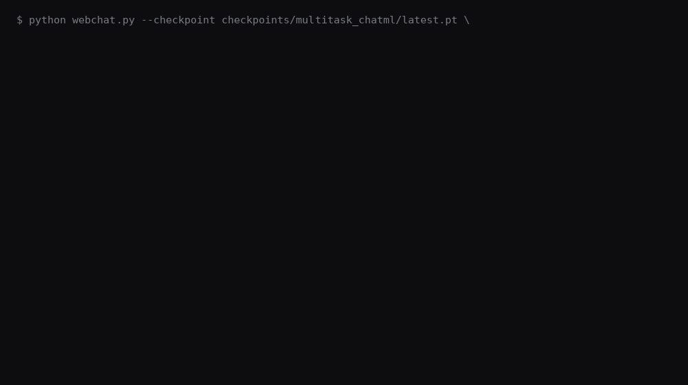

# 🧠 TinyLLM — Build an LLM From Scratch

> A minimal, heavily-commented GPT-style language model (~20M parameters) for learning purposes.
> Every component is implemented from scratch — no HuggingFace, no pre-built transformers.

**Who this is for:** anyone who wants to understand *how* an LLM like GPT actually works —
tokenizer, transformer, training loop, and text generation — by reading code you can run and
change, not by reading about someone else's black box. No prior deep learning experience
is assumed; the [What You'll Learn](#-what-youll-learn) section below explains each concept
from first principles.

## 📑 Table of Contents

- [Demo](#-demo)
- [What You'll Learn](#-what-youll-learn)
- [Custom Q&A Dataset](#-custom-qa-dataset)
- [Quick Start](#-quick-start)
- [Model Size Reference](#-model-size-reference)
- [Limitations & Caveats](#-limitations--caveats)
- [Experiment Ideas](#-experiment-ideas)
- [Key Papers](#-key-papers)

---

## 🎬 Demo



One 50M-param checkpoint (`train_reasoning.py --dataset_format chatml`) trained jointly on
multi-turn small talk and 1-/2-/3-hop synthetic word problems, pooled as equals rather than
one being "replay" for the other — see `data_utils.prepare_multitask_data`. Turns are
rendered ChatML-style (`<|im_start|>{role}...<|im_end|>`, same scheme Qwen/GPT use), and the
loss is masked to assistant spans only. The reasoning trace is real and unedited: each
`<CALC>` call is the model deciding *when* and *what* to compute, with the actual arithmetic
result injected rather than guessed (`model/calculator.py`, `model/generate.py`) — in
`webchat.py` that trace renders as a collapsible "Thoughts" section, Claude/ChatGPT-style,
instead of inline with the answer. The 3 reasoning problems shown are held out — never seen
during training.

---

## 📚 What You'll Learn

### 🔤 1. BPE Tokenization (`tokenizer.py`)

**Byte Pair Encoding** is how GPT-2/GPT-4 turn raw text into numbers.

**The algorithm:**
1. Start with characters as vocabulary
2. Count all adjacent token pairs in the corpus
3. Merge the most frequent pair into a new token
4. Repeat until vocab size is reached

> 💡 **Key insight:** `"lower"` → `["▁low", "er"]`, `"lowest"` → `["▁low", "est"]`.
> Common subwords get merged; rare words stay as characters. Handles OOV words gracefully.

**Special tokens:**

| Token | ID | Purpose |
|-------|----|---------|
| `<PAD>` | 0 | Padding |
| `<UNK>` | 1 | Unknown token |
| `<BOS>` | 2 | Beginning of sequence |
| `<EOS>` | 3 | End of sequence ← **model stops here** |

---

### 🏗️ 2. Transformer Architecture (`model.py`)

#### 🔍 Multi-Head Self-Attention
```
Attention(Q, K, V) = softmax(QK^T / sqrt(d_k)) * V
```
| Symbol | Role |
|--------|------|
| **Q** (Query) | "What am I looking for?" |
| **K** (Key)   | "What information do I have?" |
| **V** (Value) | "What do I actually return?" |

- Division by `sqrt(d_k)` prevents softmax from saturating in high dimensions
- **Causal mask**: future tokens get `-inf` → 0 probability (autoregressive)
- **Multiple heads**: each head learns different relationship types (syntax, semantics, coreference…)

#### ⚡ Feed-Forward Network
```
FFN(x) = GELU(xW₁ + b₁)W₂ + b₂
```
Applied position-wise. Acts like "memory" — stores factual associations.

#### 🔧 Other Key Components

| Component | What it does |
|-----------|-------------|
| **Pre-norm** (`x + sublayer(LayerNorm(x))`) | More stable gradients than post-norm (GPT-2 style) |
| **Residual connections** (`x = x + sublayer(x)`) | Prevent vanishing gradients in deep networks |
| **Weight tying** | Embedding matrix and LM head share weights → fewer params |

---

### 🚀 3. Training (`train.py`)

**Objective:** Causal Language Modeling — given `[t1, t2, t3, t4]`, predict `[t2, t3, t4, t5]`.

#### 📈 Learning Rate Schedule
```
Warmup  →  lr = max_lr × (iter / warmup_iters)
Cosine  →  lr = min_lr + (max_lr - min_lr) × 0.5 × (1 + cos(π × progress))
```

#### 🛡️ Gradient Clipping
```python
torch.nn.utils.clip_grad_norm_(model.parameters(), max_norm=1.0)
```
Prevents sudden loss spikes by scaling down large gradients.

#### 🗜️ Gradient Accumulation
Simulates larger batches without extra memory:
```python
for micro_step in range(grad_accumulation_steps):
    loss = model(batch) / grad_accumulation_steps
    loss.backward()
optimizer.step()  # Only step once per "logical" batch
```

#### ⚡ Mixed Precision (bfloat16)

| Format | Bits | Range | Precision | Benefit |
|--------|------|-------|-----------|---------|
| float32 | 32 | ±3.4×10³⁸ | ~7 digits | Training stable |
| bfloat16 | 16 | ±3.4×10³⁸ | ~3 digits | **2-4× faster, ~50% less VRAM** |

> bfloat16 > float16 for training — same dynamic range, no loss scaling needed.

---

### 🖥️ 4. Multi-GPU Training with DDP (`train.py`)

```
GPU 0: model copy → forward(batch_shard_0) → backward → gradients ─┐
GPU 1: model copy → forward(batch_shard_1) → backward → gradients ─┤
                                                                     ↓
                                             All-Reduce (NCCL): avg gradients
                                                                     ↓
                                         Both GPUs update weights identically
```

**torchrun** sets these environment variables automatically:

| Variable | Meaning |
|----------|---------|
| `RANK` | Global process index (0 = master) |
| `LOCAL_RANK` | GPU index on this node |
| `WORLD_SIZE` | Total number of processes |

---

### 💬 5. Text Generation (`generate.py`)

**Autoregressive loop:** feed tokens → sample next token → append → repeat → **stop at `<EOS>`**

#### 🎲 Sampling Strategies

| Strategy | How | Effect |
|----------|-----|--------|
| **Greedy** (temp=0) | Always pick argmax | Deterministic, can be repetitive |
| **Temperature** `T < 1` | Sharpen distribution | More confident, less creative |
| **Temperature** `T > 1` | Flatten distribution | More random, more creative |
| **Top-k** | Sample from top-k tokens only | Blocks very unlikely tokens |
| **Top-p (nucleus)** | Sample from smallest set with cumulative prob ≥ p | Adaptive to model certainty |

---

## 📦 Custom Q&A Dataset

You can train TinyLLM on your own question-answer data using a simple JSON format.

### Format

```json
[
  {
    "id": 1,
    "category": "Identity",
    "question": "Who are you?",
    "answer": "I am TinyLLM, a small but capable language model here to help you!"
  },
  {
    "id": 2,
    "category": "Identity",
    "question": "What is your name?",
    "answer": "My name is TinyLLM."
  }
]
```

| Field | Required | Description |
|-------|----------|-------------|
| `id` | No | Unique identifier (ignored during training) |
| `category` | No | Grouping label (ignored during training) |
| `question` | ✅ Yes | The input question text |
| `answer` | ✅ Yes | The expected answer text |

### How It Works

Each Q&A pair is automatically wrapped with boundary tokens before training:

```
<BOS> Question: Who are you?
Answer: I am TinyLLM, a small but capable language model here to help you! <EOS>
```

This teaches the model **where answers end** — without `<EOS>` boundaries, the model would answer a question and then immediately ask itself another one and keep going indefinitely.

### Training on Custom Data

```python
from data_utils import prepare_custom_data, create_dataloader

train_ds, val_ds, tokenizer = prepare_custom_data(
    json_path="data/my_dataset.json",
    vocab_size=2000,
    context_length=128,
    force_retrain_tokenizer=True,  # retrain so BOS/EOS appear in the corpus
)

loader = create_dataloader(train_ds, batch_size=8)
```

### Stopping at `<EOS>` During Inference

Your generation loop must honour the `<EOS>` token:

```python
for _ in range(max_new_tokens):
    logits = model(input_ids)
    next_token = logits[:, -1, :].argmax(dim=-1)
    if next_token.item() == tokenizer.eos_id:
        break                                        # ← stop here!
    input_ids = torch.cat([input_ids, next_token.unsqueeze(0)], dim=1)
```

---

## ⚡ Quick Start

### Install
```bash
pip install torch --index-url https://download.pytorch.org/whl/cu121
```

### Train (single GPU)
```bash
python train.py
```

### Train (multi-GPU)
```bash
torchrun --nproc_per_node=2 train.py
```

### Train with custom settings
```bash
torchrun --nproc_per_node=2 train.py \
    --batch_size 32 \
    --max_iters 5000 \
    --d_model 512 \
    --n_layers 8
```

### Monitor training with Weights & Biases
Both `train.py` (SFT) and `pretrain.py` support optional [W&B](https://wandb.ai) logging of train/val
loss, perplexity, learning rate, tokens/sec, and gradients — off by default, opt in with `--use_wandb`.
```bash
pip install wandb
wandb login
python train.py --use_wandb --wandb_project tinyllm-sft --wandb_run_name my-run
python pretrain.py --use_wandb --wandb_project tinyllm-pretrain
```

### Generate text
```bash
python generate.py \
    --checkpoint checkpoints/latest.pt \
    --prompt "Who are you?" \
    --temperature 0.8 \
    --top_k 50 \
    --max_tokens 300
```

---

## 📐 Model Size Reference

| Config              | d_model | n_layers | n_heads | vocab_size | context_length | d_ff | Params |
|---------------------|---------|----------|---------|------------|----------------|------|--------|
| 🐭 Tiny (default)   | 384     | 6        | 6       | 10000          | 256              | 512    | ~10M  |
| 🐱 Small            | 512     | 8        | 8       | 10000          | 256              | 1024    | ~22M   |
| 🐻 Medium           | 768     | 12       | 12      | 10000          | 256              | 1536    | ~65M  |

---

## ⚠️ Limitations & Caveats

TinyLLM is a *learning tool*, not a production model — knowing where it falls short is
part of understanding how it works:

- **No world knowledge.** At 10M–65M parameters trained on a small corpus, it has nowhere
  near enough capacity or data to have memorized facts the way GPT-3/4 does. It will
  confidently make things up (hallucinate) outside what it was trained on.
- **Short context window.** `context_length` is 256 tokens by default — a few paragraphs.
  Long documents or long conversations will simply fall off the front of the window.
  Compare to production LLMs, which use 32K–1M+ token windows.
- **Small vocabulary.** `vocab_size=10000` (vs. ~100K+ for GPT-4-class tokenizers) means
  more tokens per word on average, especially for rare words or non-English text.
- **The `<CALC>` tool only does arithmetic.** `model/calculator.py` supports `+ - * /`
  and parentheses — no algebra, no unit conversion, no comparisons. It's real (not
  guessed) arithmetic, but the model still has to correctly decide *which* numbers and
  operation to plug in, which is the actual hard part (see `generate_synthetic_reasoning.py`).
- **Reasoning is on synthetic, templated word problems**, not open-domain math (like
  GSM8K) or general reasoning. This narrows the skill on purpose so it's learnable at
  this scale — it does not mean the model can reason broadly.
- **No RLHF / safety alignment.** Training is supervised fine-tuning (SFT) only —
  there's no preference-tuning or safety filtering step, so outputs aren't guarded
  against harmful, biased, or unsafe content the way deployed assistants are.
- **Demo examples are held-out but few.** The `<CALC>` reasoning examples shown in the
  demo are unseen during training, but the held-out set is small — treat the demo as a
  qualitative illustration, not a statistically rigorous benchmark result.

---

## 🔬 Experiment Ideas

Once the base model is training, try these:

| # | Experiment | Where |
|---|-----------|-------|
| 1 | Sinusoidal vs learned positional embeddings | `--use_learned_pos_emb False` |
| 2 | Swap GELU for ReLU or SiLU | `model.py` FFN block |
| 3 | RoPE positional encoding (used in LLaMA) | Add to `model.py` |
| 4 | Flash Attention (drop-in, better memory) | Replace `MultiHeadAttention` |
| 5 | Different datasets — Bible, Project Gutenberg | `data_utils.py` |
| 6 | Scaling laws — train on 10× more data | Watch val loss curve |
| 7 | SwiGLU activation (`SwiGLU(x) = (xW+b) × σ(xV+c)`) | `model.py` FFN block |

---

## 📖 Key Papers

| Paper | Authors | Why read it |
|-------|---------|-------------|
| [Attention Is All You Need](https://arxiv.org/abs/1706.03762) | Vaswani et al., 2017 | Original Transformer |
| [Language Models are Unsupervised Multitask Learners](https://cdn.openai.com/better-language-models/language_models_are_unsupervised_multitask_learners.pdf) | Radford et al., 2019 | GPT-2 |
| [An Image is Worth 16×16 Words](https://arxiv.org/abs/2010.11929) | Dosovitskiy et al., 2020 | ViT — shows transformers work everywhere |
| [Training Compute-Optimal LLMs](https://arxiv.org/abs/2203.15556) | Hoffmann et al., 2022 | Chinchilla scaling laws |